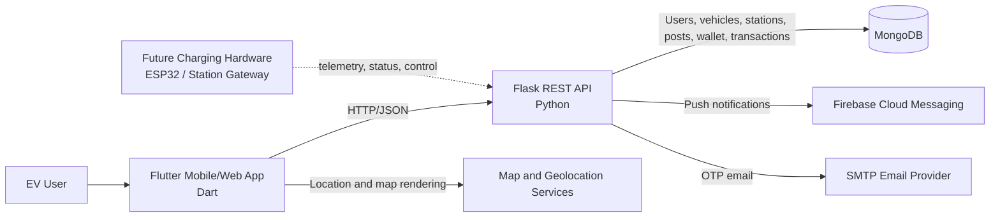

# OSMION EV

> A Flutter-based electric-vehicle charging companion for discovering charging stations, managing vehicles and wallet transactions, reserving charging slots, and building a connected EV community.

[](https://www.sih.gov.in/)
[](https://flutter.dev/)
[](https://dart.dev/)
[](https://www.python.org/)
[](https://flask.palletsprojects.com/)
[](https://www.mongodb.com/)
[](#continuous-integration)
[](#license)

## Table of Contents

- [Overview](#overview)
- [SIH 2025 Context](#sih-2025-context)
- [Problem Statement](#problem-statement)
- [Solution Summary](#solution-summary)
- [System Architecture](#system-architecture)
- [Key Features](#key-features)
- [Technology Stack](#technology-stack)
- [Repository Structure](#repository-structure)
- [Getting Started](#getting-started)
- [Backend Setup](#backend-setup)
- [Flutter Application Setup](#flutter-application-setup)
- [Configuration Reference](#configuration-reference)
- [API Surface](#api-surface)
- [Data Model](#data-model)
- [Security and Privacy](#security-and-privacy)
- [Hardware and IoT Roadmap](#hardware-and-iot-roadmap)
- [Testing and Quality](#testing-and-quality)
- [Roadmap](#roadmap)
- [SIH Submission Scope](#sih-submission-scope)
- [Contributing](#contributing)
- [Contributors](#contributors)
- [License](#license)

## Overview

**OSMION EV** is a cross-platform Flutter application backed by a Flask REST API and MongoDB. It is designed to make EV charging more discoverable, manageable, and community-oriented.

The current implementation combines:

- Charging-station discovery and map-based exploration.
- User registration and OTP-based authentication flows.
- EV and connector-profile management.
- Charging-slot and station-related application screens.
- Wallet balance and charging transaction records.
- Community posts, comments, and upvotes.
- Well-wisher relationships and SOS notifications.
- Firebase Cloud Messaging integration for push notifications.
- Profile management, profile-image uploads, rewards, and transaction history.

The repository is currently an **application-first EV mobility platform**. ESP32 firmware, electrical charging control, sensor telemetry, and production-grade device authentication are not yet represented as standalone modules in the repository; they are documented below as planned integration points rather than claimed implemented capabilities.

## SIH 2025 Context

- **Event:** Smart India Hackathon 2025
- **Project:** OSMION EV
- **Domain:** Electric mobility, charging infrastructure, connected mobility, and EV user services
- **Problem Statement ID and official title:** _To be completed with the assigned SIH 2025 problem statement._

> Replace the placeholder above with the official SIH problem statement ID and title before submitting or publishing a final project report. The repository does not currently contain the official statement text.

## Problem Statement

### Challenge

EV adoption is affected not only by vehicle cost and range, but also by the availability, discoverability, usability, and trustworthiness of charging infrastructure. Users need a single place to find stations, manage vehicle compatibility, plan charging, pay for sessions, receive notifications, and access help during emergencies.

### Why fragmented solutions are insufficient

Traditional or fragmented approaches commonly require users to:

- Search across multiple station providers and map services.
- Manually verify connector compatibility and station availability.
- Use separate applications for charging, payments, support, and community information.
- Rely on phone calls or unstructured messaging for emergency assistance.
- Maintain vehicle, wallet, and transaction information in disconnected systems.

OSMION addresses this fragmentation with a unified mobile experience and a backend service that centralizes user, vehicle, station, community, notification, wallet, and transaction workflows.

## Solution Summary

OSMION provides a mobile-first control surface for EV users:

1. A user creates an account and verifies access using an OTP workflow.
2. Vehicle details and connector type are stored with the user profile.
3. Charging stations can be displayed and explored through the application.
4. Users can manage wallet balance and record charging transactions.
5. Users can participate in an EV community through posts, comments, and upvotes.
6. Well-wishers can be configured for emergency notifications.
7. An SOS event can trigger Firebase Cloud Messaging notifications to configured contacts.

The backend uses Flask routes as an integration layer between the Flutter application, MongoDB collections, email delivery, Firebase Admin SDK, and future charging-device services.

## System Architecture

### High-level architecture



### Runtime data flow

```text
+----------------------+       HTTPS/JSON       +----------------------+
| Flutter Application  | <--------------------> | Flask REST API       |
| - Auth and profile   |                        | - Auth workflows     |
| - Station discovery  |                        | - Station endpoints  |
| - Wallet and payment |                        | - Community APIs     |
| - Community and SOS  |                        | - Wallet/transactions|
+----------+-----------+                        +----------+-----------+
           |                                               |
           | Map/geolocation                               | MongoDB queries
           v                                               v
+----------------------+                        +----------------------+
| Map/Location Stack   |                        | MongoDB              |
+----------------------+                        | Osmion database      |
                                                | EV/community data    |
                                                +----------+-----------+
                                                           |
                             +-----------------------------+------------------+
                             |                                                |
                             v                                                v
                    +----------------------+                         +------------------+
                    | Firebase Admin/FCM  |                         | SMTP Mail Server |
                    | SOS/push messaging   |                         | OTP delivery     |
                    +----------------------+                         +------------------+
```

### Application and API layer

The current repository contains the following implemented layers:

| Layer | Implementation | Responsibility |
|---|---|---|
| Mobile/client | Flutter and Dart | User interface, navigation, local login state, API calls, maps, notifications, profile and EV workflows |
| REST API | Flask | Authentication, profile, vehicle, station, community, SOS, wallet, and transaction endpoints |
| Persistence | MongoDB via PyMongo | User, OTP, vehicle, station, post, comment, well-wisher, and transaction collections |
| Push messaging | Firebase Admin SDK and FCM | Device-token storage and SOS notifications |
| Email | Flask-Mail over SMTP | OTP delivery and account-related email workflows |
| Media storage | Local `backend/uploads` directory | Profile-image uploads in the current development implementation |

### Hardware/edge layer

No firmware or hardware-control source is currently present in the repository. The intended future edge layer is:

- EV charging-station gateway or ESP32-class controller.
- Station status and availability telemetry.
- Connector, relay, current, voltage, energy, and temperature measurements.
- Local safety interlocks and fail-safe control.
- Store-and-forward buffering when the network is unavailable.
- Authenticated telemetry and command exchange with the backend.

Any electrical switching, charging-control, or safety-critical implementation must be validated against applicable electrical, charging, and regulatory requirements before deployment.

### Communication and security protocol

Current communication is HTTP/JSON between the Flutter app and Flask API. For production deployment, use:

- HTTPS/TLS for every client and server connection.
- Authenticated API sessions rather than trusting email fields alone.
- Short-lived access tokens and refresh-token rotation.
- Rate limiting and abuse protection for OTP and SOS endpoints.
- TLS-secured MongoDB connections with least-privilege database users.
- Secret management through environment variables or a cloud secret manager.
- Signed firmware and mutual TLS for future station gateways.
- Audit logs for charging commands, wallet mutations, and emergency events.

## Key Features

### EV user experience

- Charging-station discovery and map-based exploration.
- Vehicle registration with make, model, registration number, connector type, and capacity metadata.
- User profile creation, editing, and profile-image upload.
- Wallet balance display and wallet top-up workflow.
- Charging transaction creation and transaction-history retrieval.
- Charging-slot and station-oriented application modules.

### Authentication and notifications

- Email-based OTP generation and verification.
- Persistent login state using Flutter `shared_preferences`.
- Firebase Cloud Messaging integration.
- Background notification handling in the Flutter application.
- Well-wisher management and SOS alert delivery.

### Community and engagement

- Community post listing and creation.
- Comments for individual posts.
- Post upvotes.
- User search for community and well-wisher workflows.
- Rewards and engagement-oriented application modules.

### Extensibility

- REST API boundary for future charging-station integrations.
- MongoDB collections separated by domain responsibility.
- Service-oriented Flutter directory layout.
- Clear path for adding live station telemetry, reservations, remote commands, and payment-provider integrations.

## Technology Stack

| Category | Technologies currently used | Notes |
|---|---|---|
| Client framework | Flutter | Cross-platform application target |
| Client language | Dart `^3.9.2` | Declared in `pubspec.yaml` |
| Backend framework | Flask | Python REST API in `backend/app.py` |
| Database | MongoDB | Accessed through PyMongo |
| Push notifications | Firebase Core, Firebase Messaging, Firebase Admin SDK | Mobile notifications and SOS delivery |
| Email | Flask-Mail and SMTP | OTP delivery |
| Maps and location | `flutter_map`, `latlong2`, `geolocator`, `flutter_map_location_marker` | Map UI and device location |
| Client storage | `shared_preferences`, `flutter_secure_storage` | Session preferences and secure local storage support |
| Media | `image_picker` | Profile-image selection |
| HTTP | Dart `http` package | API requests from Flutter |
| Platforms | Android, iOS, Linux, macOS, Web, Windows | Generated Flutter platform targets are present |
| Future edge | ESP32/MCU, C/C++ or MicroPython | Planned; not currently included |
| Future protocols | MQTT over TLS/mTLS or HTTPS | Planned for station telemetry |

## Repository Structure

```text
Osmion_EV/
├── android/                         # Android platform project
├── assets/                          # Application assets
├── backend/
│   └── app.py                       # Flask API, MongoDB, mail, FCM, and upload logic
├── ios/                             # iOS platform project
├── lib/
│   ├── main.dart                    # Flutter entry point and Firebase initialization
│   ├── api_service.dart             # Client-side REST API service
│   ├── auth/                        # Login, registration, and OTP flows
│   ├── community/                   # Community models and screens
│   ├── explore/                     # Discovery and exploration screens
│   ├── home/                        # Main application shell and home screens
│   ├── profile/                      # Profile management
│   ├── rewards/                      # Rewards-related screens
│   ├── services/                     # Notification and shared services
│   ├── slot_booking/                 # Slot-booking screens
│   ├── transaction_history/          # Transaction history screens
│   └── wallet/                       # Wallet screens and workflows
├── linux/                            # Linux platform project
├── macos/                            # macOS platform project
├── web/                              # Web platform project
├── windows/                          # Windows platform project
├── analysis_options.yaml              # Dart analyzer configuration
├── pubspec.yaml                      # Flutter dependencies and assets
├── pubspec.lock                      # Resolved Flutter dependency versions
└── README.md                         # Project documentation
```

## Getting Started

### Prerequisites

Install the following before running the project:

| Requirement | Recommended baseline | Purpose |
|---|---|---|
| Git | Current stable release | Source checkout and version control |
| Flutter SDK | Compatible with Dart `3.9.2` | Build and run the application |
| Dart SDK | Provided by Flutter | Dart compilation and analysis |
| Python | 3.10+ recommended | Flask backend |
| MongoDB | Local Community Edition or managed instance | Application persistence |
| Firebase project | Android/iOS app registrations | Push notifications and Firebase initialization |
| SMTP account | Development SMTP provider or Gmail app password | OTP delivery |
| Android Studio/Xcode | Platform-specific | Mobile SDKs, emulators, and signing |

### Clone the repository

```bash
git clone https://github.com/Aathisivansk/Osmion_EV.git
cd Osmion_EV
```

## Backend Setup

The backend is a Flask application in `backend/app.py`.

### 1. Create a virtual environment

```bash
cd backend
python -m venv .venv

# macOS/Linux
source .venv/bin/activate

# Windows PowerShell
.venv\Scripts\Activate.ps1
```

### 2. Install backend dependencies

The repository does not currently include a committed `requirements.txt`. Install the packages imported by the backend:

```bash
python -m pip install --upgrade pip
pip install flask flask-cors flask-mail pymongo bson python-dotenv firebase-admin werkzeug
```

For reproducible deployments, generate and review a locked dependency file after installation:

```bash
pip freeze > requirements.txt
```

### 3. Start MongoDB

Start a local MongoDB service or provision a managed MongoDB deployment. The current development code expects MongoDB at:

```text
mongodb://localhost:27017/
```

The backend uses these databases and collections:

| Database | Collections |
|---|---|
| `charging_stations_db` | `stations` |
| `Osmion` | `User_Auth`, `OTPs`, `Vehicles`, `well_wishers`, `transactions` |
| `ev_community_db` | `posts`, `comments` |

### 4. Configure Firebase credentials

Create a Firebase Admin SDK service-account key and store it outside version control. Set:

```bash
export FIREBASE_CREDENTIALS_PATH=/absolute/path/to/serviceAccountKey.json
```

On Windows PowerShell:

```powershell
$env:FIREBASE_CREDENTIALS_PATH = "C:\secure\serviceAccountKey.json"
```

Do not commit service-account JSON files, API keys, SMTP passwords, or production database credentials.

### 5. Configure mail delivery

The current backend contains development mail configuration directly in `app.py`. Before use outside a local prototype, move the following values to environment variables and rotate any credentials that may have been exposed:

- SMTP host and port.
- SMTP username.
- SMTP password or app password.
- TLS/SSL mode.
- Default sender address.

A production-safe configuration should fail fast when required secrets are missing instead of using source-code defaults.

### 6. Run the API

From `backend/`:

```bash
python app.py
```

The development server listens on:

```text
http://127.0.0.1:5000
```

The current code binds to `0.0.0.0:5000`, which exposes the development server on all network interfaces. Use a production WSGI server and a reverse proxy for deployment.

## Flutter Application Setup

From the repository root:

```bash
flutter doctor
flutter pub get
flutter analyze
flutter test
```

### Firebase client configuration

The Flutter application initializes Firebase at startup and uses Firebase Messaging. Complete the platform setup before running on a physical device:

- Android: add the Firebase Android configuration file and configure the package/application ID.
- iOS: add the Firebase iOS configuration file and configure APNs capabilities.
- Web/desktop: configure Firebase only if those targets are intended to support the notification workflow.

Do not commit private Firebase Admin credentials. Client configuration files may also require environment-specific handling depending on your deployment policy.

### Configure the API endpoint

The current API service defines a development LAN address in `lib/api_service.dart`. Replace it with the address reachable from your emulator or device, preferably through a build-time configuration mechanism rather than editing source code.

For local development:

```bash
flutter run
```

For a release build:

```bash
flutter build apk --release
# or
flutter build appbundle --release
```

### Emulator networking notes

- Android emulator access to a backend running on the host machine commonly uses `10.0.2.2` instead of `127.0.0.1`.
- iOS Simulator can generally access host services through `127.0.0.1`.
- A physical device must use the host machine's LAN IP and the backend firewall must permit the port.
- Production mobile builds must use HTTPS and a stable API hostname.

## Configuration Reference

### Environment variables

The current code directly reads `FIREBASE_CREDENTIALS_PATH`. The remaining values below are recommended configuration variables for hardening and deployment; wiring them into the application is part of the production-readiness roadmap.

| Variable | Required | Example | Description |
|---|---:|---|---|
| `FIREBASE_CREDENTIALS_PATH` | Yes for FCM | `/run/secrets/firebase.json` | Firebase Admin service-account path |
| `MONGO_URI` | Recommended | `mongodb://localhost:27017/` | MongoDB connection string |
| `MAIL_SERVER` | Recommended | `smtp.example.com` | SMTP host |
| `MAIL_PORT` | Recommended | `465` | SMTP port |
| `MAIL_USERNAME` | Recommended | `noreply@example.com` | SMTP sender account |
| `MAIL_PASSWORD` | Recommended | `***` | SMTP credential or app password |
| `MAIL_USE_TLS` | Recommended | `false` | Enable STARTTLS where appropriate |
| `MAIL_USE_SSL` | Recommended | `true` | Enable implicit TLS where appropriate |
| `UPLOAD_FOLDER` | Optional | `uploads` | Profile-image storage directory |
| `API_BASE_URL` | Recommended | `https://api.example.com` | Flutter backend base URL |

### Pin mapping and hardware status

There is no embedded firmware or hardware pin mapping in the current repository. The following table is a **proposed future integration template**, not a verified wiring specification:

| Signal | Proposed controller pin | Component | Direction | Status |
|---|---|---|---|---|
| Station status/current sensor | To be validated | Current/energy meter | Input | Planned |
| Connector temperature | To be validated | Temperature sensor | Input | Planned |
| Relay/contactor control | To be validated | Isolated driver | Output | Planned |
| Emergency-stop input | To be validated | Safety interlock | Input | Planned |
| Network link | Wi-Fi/Ethernet module dependent | Station gateway | Bidirectional | Planned |

Do not connect mains-voltage equipment directly to an MCU. Any charging-control hardware requires galvanic isolation, appropriate protection, certified contactors, emergency-stop handling, enclosure design, and review by a qualified electrical engineer.

## API Surface

The Flask backend exposes representative routes in the following groups:

| Domain | Example endpoints | Purpose |
|---|---|---|
| Authentication | `POST /api/check_email`, `POST /api/send_otp`, `POST /api/verify_otp`, `POST /api/register` | Account and OTP workflows |
| Profile | `GET/PUT /api/profile/<email>`, `POST /api/profile/image` | Profile retrieval, updates, and image uploads |
| Vehicles | `POST /api/add_vehicle`, `GET /api/vehicles/<email>` | EV metadata management |
| Stations | `GET /api/stations` | Charging-station listing |
| Community | `GET /api/posts`, `POST /api/posts/create` | Post feed and creation |
| Comments | `GET /api/post/<id>/comments`, `POST /api/post/<id>/comment` | Comment retrieval and creation |
| Engagement | `POST /api/posts/<id>/upvote` | Post upvotes |
| Well-wishers | `/api/well_wishers/*`, `/api/users/search` | Contact relationships and search |
| SOS | `POST /api/sos/trigger` | Emergency notification workflow |
| Wallet | `POST /api/wallet/add` | Wallet balance update |
| Transactions | `POST /api/transactions/create`, `GET /api/transactions/<email>` | Charging transaction records |
| Notifications | `POST /api/user/fcm_token` | FCM-token registration |

> The API is currently development-oriented. Before public deployment, add authentication middleware, schema validation, authorization checks, rate limiting, structured error handling, API documentation, and automated integration tests.

## Data Model

The current backend uses MongoDB documents rather than a formal migration-managed relational schema.

### User document

Typical fields include:

- `name`
- `email`
- `address`
- `pincode`
- `mobile`
- `fcmToken`
- `profileImageUrl`
- `walletBalance`

### Vehicle document

Typical fields include:

- `user_email`
- `make`
- `model`
- `register_no`
- `connector_type`
- `capacity` when supplied by the client

### Transaction document

Typical fields include:

- `user_email`
- `station_name`
- `amount`
- `payment_method`
- `timestamp`

## Security and Privacy

### Current considerations

The project includes secure-storage dependencies on the Flutter side and Firebase-based notification delivery. However, the current development implementation still requires security hardening before production use:

- API calls use a development HTTP endpoint and must be migrated to HTTPS.
- Several backend configuration values are currently source-controlled or hard-coded and must be externalized and rotated.
- OTPs need expiration, attempt limits, replay protection, and abuse controls.
- API routes currently identify users through request data such as email and require proper authentication and authorization.
- Uploads need MIME validation, size limits, malware scanning, and non-public object storage.
- Wallet operations require authenticated, atomic, auditable payment workflows.
- SOS notifications require consent, privacy controls, delivery monitoring, and abuse prevention.

### Recommended production security model

1. Authenticate every client using short-lived signed tokens.
2. Authorize access to profiles, vehicles, wallets, and transactions by subject identity.
3. Store secrets in a secret manager, never in Git.
4. Enforce TLS for app, API, database, SMTP, and future device traffic.
5. Add structured audit events for financial and safety-critical operations.
6. Minimize personal data collection and define retention/deletion policies.
7. Encrypt sensitive data at rest and in transit.
8. Add dependency scanning, secret scanning, static analysis, and vulnerability monitoring.

## Hardware and IoT Roadmap

The repository language composition includes Dart, Python, C++, CMake, Swift, and C, but the current application tree does not yet provide a dedicated firmware project. A future station-integration module could be organized as follows:

```text
firmware/
├── platformio.ini
├── src/
│   ├── main.cpp
│   ├── telemetry.cpp
│   ├── safety_controller.cpp
│   └── network_client.cpp
├── include/
│   └── config.example.h
└── test/
    ├── test_safety_controller.cpp
    └── test_telemetry.cpp
```

Candidate future hardware capabilities:

- ESP32 or industrial station gateway.
- Energy meter, voltage/current sensors, connector detection, and temperature sensors.
- Isolated relay/contactor drivers.
- Local over-current, over-temperature, and emergency-stop interlocks.
- MQTT over TLS/mTLS for telemetry and commands, or a secured HTTPS gateway.
- Offline event buffering and monotonic event identifiers.
- Remote firmware-update support with signed images.

## Testing and Quality

Run the current Flutter checks from the repository root:

```bash
flutter analyze
flutter test
```

Recommended additions:

- Flask unit and integration tests using a temporary MongoDB instance.
- API contract tests for all client-consumed routes.
- Authentication, OTP-expiry, authorization, and rate-limit tests.
- Wallet idempotency and transaction consistency tests.
- Firebase notification tests using a staging project.
- Widget and golden tests for critical Flutter screens.
- Hardware-in-the-loop tests when station firmware is introduced.
- Secret scanning and dependency vulnerability checks.

### Continuous Integration

No GitHub Actions workflow is currently present in the repository. A future CI pipeline should run:

```text
Flutter format/checks -> Flutter analyze -> Flutter tests ->
Python formatting/linting -> Backend tests -> Dependency/security scans
```

## Roadmap

### Near term

- Add a backend dependency lock file and documented `.env.example`.
- Move all credentials, host addresses, and SMTP settings out of source code.
- Replace development HTTP URLs with configurable API environments.
- Add API authentication and authorization middleware.
- Add request validation, logging, health checks, and API documentation.
- Add automated Flutter and Flask test coverage.

### SIH-scale product enhancements

- Live station availability and connector occupancy.
- Reservation and queue management with conflict prevention.
- Charging-session start/stop workflows.
- Energy consumption and cost analytics.
- Payment-provider integration with receipts and refunds.
- Station-operator dashboard and maintenance alerts.
- Accessibility improvements and regional-language support.
- Offline-first station discovery and resilient synchronization.

### Future connected-infrastructure enhancements

- ESP32 or industrial gateway telemetry.
- Secure MQTT/mTLS device identity.
- Remote diagnostics and signed OTA firmware updates.
- Predictive maintenance from station health metrics.
- Demand-aware charging and load balancing.
- Integration with open charging protocols where appropriate.

## SIH Submission Scope

For the SIH 2025 submission, document the following project-specific details in the final version of this README or an accompanying `docs/sih-submission.md` file:

- Official problem statement ID and title.
- Team name, institution, and member list.
- Judging-track domain and stated target users.
- Demonstrated prototype workflow.
- Hardware bill of materials, if hardware is part of the submission.
- Architecture and data-flow diagrams.
- Security, privacy, and safety assumptions.
- Measured outcomes such as time saved, station discoverability, workflow completion, or notification latency.
- Demo credentials or staging instructions that do not expose secrets.
- Known limitations and post-hackathon implementation plan.

## Contributing

Contributions are welcome. Before opening a pull request:

1. Create a feature branch.
2. Keep secrets and private Firebase files out of Git.
3. Run `flutter analyze` and `flutter test`.
4. Add or update backend tests for API changes.
5. Document new environment variables and endpoints.
6. Explain migration or compatibility considerations.
7. Use focused commits and a clear pull-request description.

Suggested branch names:

```text
feature/station-availability
fix/otp-expiry
chore/secure-config
```

## Contributors

This project was developed for **Smart India Hackathon 2025** by the OSMION team.

Add the final team attribution here:

| Name | Role | GitHub/Contact |
|---|---|---|
| _Team member_ | _Role_ | _Profile or contact_ |
| _Team member_ | _Role_ | _Profile or contact_ |
| _Team member_ | _Role_ | _Profile or contact_ |

## License

No license file is currently present in the repository. Until a license is explicitly added by the copyright holders, the project should be treated as **all rights reserved** and should not be redistributed or reused as open-source software.

If the team chooses an open-source license, add the corresponding `LICENSE` file and update this section. Common options include:

- **MIT License** — permissive and concise.
- **Apache License 2.0** — permissive, with an express patent grant.

Do not claim MIT or Apache-2.0 licensing until the selected license text has been committed.

---

<p align="center">
  Built for connected, accessible, and user-centered electric mobility.
</p>
